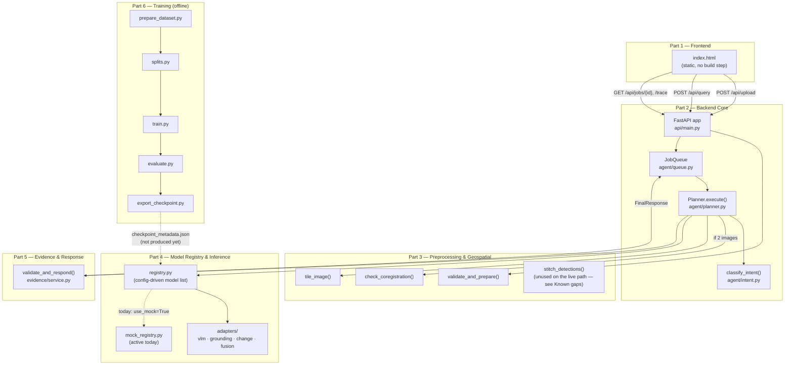

# SatQuery AI — System Design

SIH 2026, Problem Statement 26167: an agentic vision-language assistant that
answers natural-language questions about single, cross-modal (optical+SAR),
and bi-temporal remote-sensing imagery — routing each query to the right
specialist model automatically instead of exposing GIS/ML parameters to the
user. Full problem statement and part-by-part spec: `architecture.md` in
this same folder. This document covers the system as actually merged and
built, not just as planned — where the two differ, that's called out
explicitly rather than smoothed over.

## Architecture

## Component map

| Part | Status | Key files | What it does |
|---|---|---|---|
| 1. Frontend | Real, unchanged | `frontend/index.html` | Upload UI, query box, polls job status, renders boxes/change-maps over the image |
| 2. Backend Core | Real; `api/main.py` edited at its own designated integration point | `backend/agent/`, `backend/api/main.py` | HTTP surface, intent classification, task sequencing, bounded concurrency |
| 3. Preprocessing & Geospatial | Real, unchanged | `backend/preprocessing/` | Validates uploads, tiles large images, checks bi-temporal alignment |
| 4. Model Registry & Inference | Real, unchanged except two adapter fixes (below) | `backend/model_registry/` | Config-driven model selection; adapters per task type; **running on its own mock engine today** (see Known gaps) |
| 5. Evidence & Response | Real, unchanged | `backend/evidence/` | Turns raw model output into grounded text + confidence; deterministic template mode (no LLM wired up — that's its zero-setup default, not a missing piece) |
| 6. Training | Real, extended (resumability, GPU-tier configs, dry-run) | `training/` | Produces the fine-tuned checkpoint Part 4 would load; **no real checkpoint exists yet** — see Known gaps |

## Request lifecycle

1. **Upload** — `POST /api/upload` → `validate_and_prepare()` (Part 3): fast structural checks first (exists, extension, size — no parsing), then an isolated, timeout-guarded metadata probe, then the pixel-count cap (before any array is allocated), then COG conversion. Every path — valid or rejected — returns a schema-valid `ImageMetadata`.
2. **Query** — `POST /api/query` → `classify_intent()` (Part 2) maps the query + image count/modality to a `TaskType`, then `JobQueue` hands it to `Planner.execute()` and returns a `job_id` immediately.
3. **Planner** (Part 2), per job:
   - Two images? → `check_coregistration()` (Part 3) first; misaligned pairs are refused here, before any tiling/inference cost is spent.
   - `tile_image()` (Part 3) splits the image(s) into a grid (default 1024px, 15% overlap — same grid for two images of identical dimensions, which is what keeps before/after tiles aligned tile-for-tile).
   - `run_inference()` (Part 4) — registry picks the adapter for the task, the adapter runs the (today: mock) model per tile/tile-pair and returns one `Evidence`.
   - `validate_and_respond()` (Part 5) — turns `Evidence` into grounded text, estimates confidence, decides whether to abstain.
4. **Poll** — `GET /api/jobs/{id}` for status/result, `GET /api/jobs/{id}/trace` for the auditable execution summary the problem statement asks for (selected task, models used, key parameters).

## Shared contract

Every part imports the same `Evidence` / `TaskType` / `ImageMetadata` / etc. from `backend/shared/schemas.py` — architecture.md Section 4, copied verbatim. Not reproduced here; read that file directly for the actual field list.

## Integration engineering done during the merge

Six parts were built independently, then merged in two passes (Parts 1/2/4/5/6, then Part 3). What follows is what the merge actually had to reconcile — not a changelog of trivial file-copying.

**Import-root drift, and why it's not just a path problem.** Part 2 imports the shared schema bare, as `shared.schemas` (built assuming `backend/` itself is the import root). Parts 3, 4, and 5 import the identical file as `backend.shared.schemas` (built assuming the repo root is). Both conventions run throughout each part's own internals — not swappable without rewriting well beyond one integration point. Fix: both roots go on `sys.path` (`pytest.ini`'s `pythonpath = . backend`, matching setup in `main.py`/`conftest.py`), **and** `backend.shared`/`backend.shared.schemas` are aliased in `sys.modules` to the exact same module objects `shared`/`shared.schemas` resolve to. Without the alias, Python would load `schemas.py` twice under two names, producing two non-identical `Evidence` classes — invisible within any one part's own tests, but exactly the kind of thing that fails Pydantic validation silently the moment a real Part 4 object crosses into a Part 2 response. Part 3 needed zero extra work here — it already used the `backend.`-prefixed convention and only relative imports internally, so it inherited the existing fix automatically.

**Sync vs. async.** Parts 3, 4, and 5's real functions are all plain `def`, not `async def` (rasterio/PyTorch calls). Part 2's own `agent/mocks.py` docstring already named the fix — `asyncio.to_thread(...)` at the call site — applied in `main.py`, nothing in Parts 3/4/5 touched.

**`shared/schemas.py` itself: checked, no drift found.** Four independent copies (Parts 2, 3, 4, 5) diffed byte-for-byte identical on every non-comment line. Kept one, taken verbatim from `architecture.md`.

**Tile-overlap duplicate detections (found, fixed).** `tiling.py`'s tile grid overlaps by 15% by design. `grounding_adapter.py` and `fusion_adapter.py` both produce a detection list built from every tile independently — before this fix, the same real-world object near a tile boundary could come back as two separate boxes, one from each overlapping tile. Fixed by running Part 3's tested `nms()` over each adapter's combined detections before returning (verified directly: two synthetic overlapping detections of the same object correctly merge into one, keeping the higher-confidence box, while a genuinely distinct detection elsewhere is left alone). `change_detection_adapter.py` was already fine — it aggregates numeric stats across tile-pairs, not a spatial detection list, so there was nothing to deduplicate there.

**Frontend wired to simulate itself by default (found, fixed).** Part 1 shipped with `CONFIG.MODE = 'mock'` in `frontend/index.html` — a deliberate, well-commented choice ("flip these two lines once Part 2 exists") so it could be demoed standalone before the backend existed. Left alone post-merge, the frontend would still silently simulate every response client-side rather than call the real (now fully wired) backend — everything would *look* connected while the two halves never actually spoke to each other. Flipped to `'real'`. Relatedly, `main.py` had no CORS configuration at all; added a permissive `CORSMiddleware` (fine for this local, single-user, no-internet-dependency deployment — Section 6 — tighten before deploying anywhere that isn't localhost) so the frontend can reach the API regardless of how each is served.

**One-command launchers (`Setup.bat` / `Start_program.bat` / `Start_training.bat`) and training-pipeline hardening (resumable data prep with a streaming-download attempt, a yield/quality circuit breaker, GPU-tier auto-detection, a pre-flight `--dry-run`) added post-merge, targeting the concrete "just make it work on my machine, don't waste GPU time on a broken run" ask.** Operational detail (what each does, why) lives in README.md, not duplicated here — this file stays about architecture and integration decisions.

## Honest verification

The environment this merge was assembled in has no network access, so `fastapi`/`pydantic`/`torch`/`rasterio` couldn't be installed to run the real test suites end-to-end. What was actually done instead, and what that does and doesn't prove:

- **Every `.py` file in the repo** — syntax-compiled clean, and every local (intra-repo) import statement resolves correctly under the dual sys.path setup above (a small static checker, not a substitute for real imports, but it does catch path/naming mistakes).
- **Part 3's 45 pure-logic tests** (`tests/test_core_logic.py`) — actually re-executed in this environment (numpy/scipy/scikit-image were available); all 45 pass. This is real coverage of the tiling grid math, phase-correlation offset estimation, NMS, RLE round-trips, and merge logic — not a claim taken on faith.
- **The real Part 2 → Part 4 → Part 5 wiring** — actually executed, using a minimal stand-in for `pydantic.BaseModel` (attribute assignment + `.model_dump()`, nothing more) since the real package isn't installable here. All seven task types plus the two-concurrent-requests case from architecture.md's own smoke-test checklist ran correctly through the real (non-mock) merged code path.
- **The grounding/fusion NMS fix** — actually executed against synthetic overlapping detections, confirmed it merges correctly.
- **Part 3's `tile_image` / `check_coregistration` / `stitch_detections` real (rasterio) code paths, and `validate_and_prepare`'s COG-conversion success path** — **not** executed here; these need rasterio (unavailable offline) plus real GeoTIFF bytes. `validate_and_prepare`'s fast-rejection paths (missing file, bad extension) *were* verified for real, since those run before rasterio is ever touched.
- **Training (`train.py`, `evaluate.py`)** — not executed at all (needs torch/transformers/peft, and a GPU for anything beyond a CPU-only shape-check). `export_checkpoint.py` was checked earlier in the merge and correctly refuses to run without a real eval report. `train.py`'s `find_latest_checkpoint()` (the resumability logic) and `select_config.py`'s VRAM-to-tier mapping — both pure-Python, no torch needed — *were* unit-tested directly against synthetic checkpoint directories and VRAM values. `prepare_dataset.py`'s resumability/filtering/circuit-breaker logic *was* actually re-run several times against synthetic local datasets — including one deliberately mostly-empty-answers and one deliberately below the record-count floor — and confirmed in each case to do what its error messages claim: skip already-processed records on a second run, and refuse to continue (rather than silently producing a near-empty training set) when too much gets filtered out or too little data remains.

**First thing to run for real, once dependencies are installed:** `pytest tests/test_integration.py -v` (Part 3's own recommendation) closes the biggest remaining gap — the rasterio-dependent I/O layer.

## Known gaps and deliberate scope decisions

Flagged rather than silently left out, per architecture.md's own "don't overengineer, do be honest about what's not done" spirit.

- **No real fine-tuned checkpoint exists yet.** `backend/model_registry/config/models.yaml`'s `checkpoint_path` entries are still placeholders; Part 4 runs on its own mock engine (`configure_engine(use_mock=True)` in `main.py`). The end-to-end demo works today because Part 4's mock engine and Part 5's template-based response generation are both designed to be schema-valid stand-ins — but the problem statement's "remote-sensing adaptation" requirement isn't satisfied until `training/run_pipeline.sh` is actually run and the real checkpoint is wired in (flip `use_mock=False`, see README.md's training section).
- **Mandatory-scope check against the literal problem statement:** "at least one visual or vision-language component must be fine-tuned... using BigEarthNet.txt **or any open source training data**." Part 6 fine-tunes on RSVQA-LR (explicitly open-source remote-sensing VQA data), which satisfies this as literally written. BigEarthNet is named as the *suggested primary dataset* in the problem background (for learning general image-text representations before task-specific fine-tuning) — not using it isn't a failure of the mandatory scope, but adding a BigEarthNet-based adaptation stage before the current RSVQA-LR fine-tune would align more closely with the suggested approach, if there's compute budget to spare (a genuine additional research/engineering effort — outlined, not built, in README.md's "Going further" section).
- **One fine-tuned adapter, not four.** `models.yaml` defines four registry entries (`satquery-vlm-base` for VQA/captioning, `satquery-grounding`, `satquery-change-bitemporal`, `satquery-fusion`) but `training/` currently only builds the first — grounding (VRSBench) and change-VQA (CDVQA) are exactly the benchmarks the problem statement names for evaluating those tasks, and neither has a training pipeline yet. Today, those three task types work end-to-end via Part 4's mock engine (schema-valid, not model-grounded). Same tradeoff as above: real, but a genuinely larger undertaking than this merge; sketched as an extension in README.md rather than attempted blind.
- **Single-tile VQA/captioning on large images.** `vlm_adapter.py` uses only the first tile (`tiles[0]`) of a multi-tile image — for an image larger than one tile (1024px default), whole-scene VQA/captioning currently only "sees" that first tile, not the full scene. Unlike the grounding/fusion fix above, this doesn't have a clean drop-in answer: merging multiple independent per-tile answers into one coherent whole-scene answer is a real design decision (run the VLM per-tile and synthesize, or downsample the *whole* image to one synthetic input instead of literally cropping), not a thin adapter shim. Worth knowing about before demonstrating VQA on a genuinely large image; a small/moderate-sized test image sidesteps it entirely (single tile, no gap).
- **`stitch_detections()` (Part 3) is real, tested, but unused on the live path.** Part 4's `run_inference` takes the whole tile list in one call and does its own internal per-tile aggregation (adapters loop over tiles themselves) rather than Part 2 calling `run_inference` per-tile and then calling Part 3's `stitch_detections` to merge — a genuine drift between how Part 3 read the architecture.md contract and how Parts 2/4 ended up calling each other. The grounding/fusion fix above (calling Part 3's `nms()` directly from inside the adapters) covers the concrete symptom this would have addressed; `stitch_detections` itself — which also mosaics raster change-map products — stays available for whoever next changes the tiling/inference call pattern.
- **No `docker/` or `docker-compose.yml`.** None of the six parts shipped one; writing one now would be premature given the checkpoint/adapter gaps above, and per README.md, native Python (not Docker) is the recommended path for laptop GPU training anyway (CUDA-in-Docker adds a layer of setup friction — WSL2 + nvidia-container-toolkit — for no benefit on a single local GPU).
- **Top-level `configs/` is empty.** Part 4 kept `models.yaml` self-contained under `backend/model_registry/config/`; its loader's default path is relative to that location, so moving it would need a code change for no functional benefit.

## Where to go from here

- Run it today, zero GPU: README.md's Quick Start.
- Train the real checkpoint: README.md's Training section (one command, GPU-tier-aware).
- Close the biggest unverified gap: `pytest tests/test_integration.py -v` after `pip install -r requirements.txt`.
