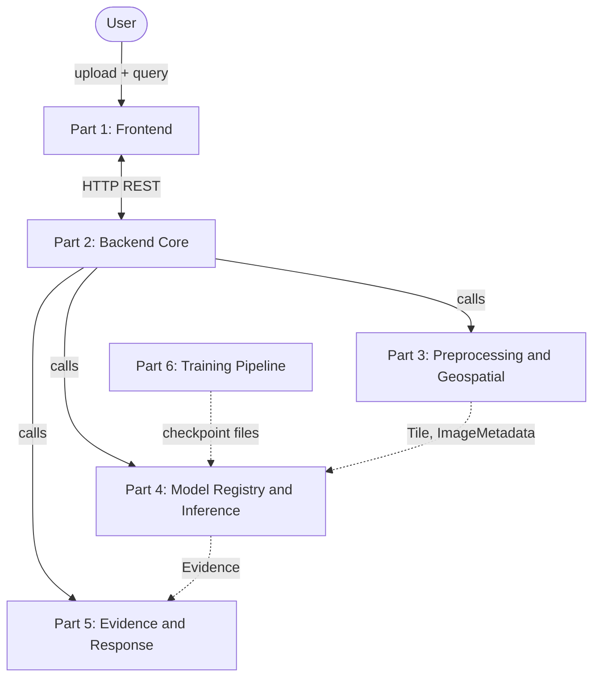

# SatQuery AI — System Architecture

Status: Phase 0 spec. No product code written yet — this file is the contract everything else gets built against.

## 0. How to use this document

This file is the single source of truth for SatQuery AI's architecture. It's written to survive being handed to a Claude session with no other context.

- **To build one part:** paste this whole file into a new conversation and say "build Part N." Section 1 gives project context, Section 4 gives the exact shared types (copy that code block into `shared/schemas.py` if it isn't already in the repo you're working in), and Section 3.N gives that part's full spec — responsibility, interface, what to mock, definition of done.
- **To connect finished parts:** paste this file plus all six parts' code into a new conversation and say "integrate these into the final project." Follow Section 5.
- Always hand over the whole file. Nothing needed is more than one section away.

## 1. Project Context

SatQuery AI is a natural-language interface over a specialist remote-sensing analysis engine, built for Smart India Hackathon 2026, problem SIH26167 (ISRO / Department of Space). A user uploads one or two satellite images (optical and/or SAR) and asks a plain-English question. The system decides what analysis answers that question and which specialist model(s) to run — the user never picks a model.

Mandatory capabilities: single-image VQA, captioning, text-guided grounding (boxes and/or masks), bi-temporal change detection, change-based VQA, optical+SAR fusion.

Non-negotiable principles:
- **Evidence-first.** The system never states a claim, number, or confidence score that isn't traced to an actual model output. Weak evidence means it says so instead of guessing.
- **Agentic, not hardcoded.** Task routing is a real planning step (query → intent → plan → specialist), not a string-matching if/else tree — though deterministic logic beats an LLM call wherever it's more reliable (CRS checks, coordinate math, thresholds).
- **Open-source, local-first.** No live external API dependency at request time. Every model runs locally.
- **Don't overengineer.** The simplest architecture that's reliable beats an impressive but fragile one — see Section 7 for an explicit "don't build" list.
- **Minimal UI.** Functional buttons only, zero polish budget. Every hour on visual design is an hour not spent on the pipeline that's actually being judged.

A companion document, `satquery-failure-mode-audit.md`, covers the full failure-mode rationale. The must-implement hardening relevant to each part is inlined in Section 3 below, so this file is self-contained even without the companion doc.

## 2. High-Level Architecture



Parts 2–5 are a **modular monolith**: one Python backend process, parts talk to each other as in-process function calls, not networked microservices. The only real network boundary is Part 1 ↔ Part 2 (different runtime — browser vs. server). Part 6 is offline/batch and only ever touches the live system through a file on disk. This is a deliberate simplicity choice, not an oversight — see Section 7.

## 3. The Six Parts

### 3.0 Overview

| Part | Name | Owns | Talks To | Runtime |
|---|---|---|---|---|
| 1 | Frontend | UI, upload, query box, results + evidence display | Part 2, via HTTP | Browser (HTML/JS or React) |
| 2 | Backend Core | API, intent classification, planner/agent, job queue, audit trail | Part 1 (HTTP), Parts 3/4/5 (function calls) | Python, FastAPI |
| 3 | Preprocessing & Geospatial | File validation, COG conversion, tiling, CRS, co-registration | Called by Part 2 | Python module (rasterio/GDAL) |
| 4 | Model Registry & Inference | VLM, grounding, change detection, fusion, GPU serving | Called by Part 2; reads Part 6's checkpoints | Python module (PyTorch/HF) |
| 5 | Evidence & Response | Evidence validation, confidence, explanation generation | Called by Part 2 | Python module |
| 6 | Training Pipeline | Dataset prep, LoRA/QLoRA fine-tuning, eval | Standalone; writes files for Part 4 | Python scripts, offline |

Each part's builder only needs: Section 1, Section 4, and their own subsection below.

---

### 3.1 Part 1 — Frontend

**Responsibility:** minimal, functional web UI. Upload, query, trigger analysis, show the answer + evidence + confidence + trace.

**In scope:** upload widget with progress bar, query text box, "Analyze" button, results panel (answer text, confidence badge, evidence overlay — boxes / mask / change-map toggle), before/after image toggle for change detection, plain execution-trace list, "download report" button.

**Explicitly out of scope:** no animations, no theming system, no custom map polish, no multi-page routing, no accounts/auth. Buttons and panels only — this is a direct instruction, not a placeholder for later polish.

**Depends on:** Part 2's HTTP API only (Section 4). Knows nothing about Parts 3–6.

**Stack:** plain HTML/CSS/JS or a minimal React app, whichever the builder is faster in.

**Calls (defined fully in Section 4):** `POST /api/upload`, `POST /api/query`, `GET /api/jobs/{id}` (poll ~1–2s), `GET /api/jobs/{id}/trace`.

**Mocking strategy:** stand up a tiny mock server returning canned JSON matching the Section 4 shapes exactly. Build and demo the whole UI against this before Part 2 exists.

**Definition of done:** upload 1–2 images, submit a query, show polling state, then render answer + confidence + at least one evidence overlay type + trace list — all against the mock server. No real backend required to call this part complete.

---

### 3.2 Part 2 — Backend Core: API, Agent/Planner, Orchestration

**Responsibility:** the brain. Owns the HTTP surface, turns a query + images into a task plan, executes the plan by calling Parts 3/4/5 in order, runs the job queue, assembles the audit trail.

**In scope:** FastAPI app implementing the endpoints below. An intent classifier — start deterministic (image count, modality, keyword/structure matching on the query), layer an LLM classifier on top only for cases the rules don't confidently resolve, fall back to `UNSUPPORTED` if neither is confident. A planner that sequences Part 3 → Part 4 → Part 5 calls per task type. A single bounded-concurrency job queue. Audit-trail logging per stage (name, status, duration).

**Out of scope:** no image processing, no model inference, no answer-text generation — those are Parts 3, 4, 5 respectively.

**Depends on:** Part 3, Part 4, Part 5 — all in-process function calls.

**HTTP endpoints it exposes (Part 1's contract):**
```
POST /api/upload
  multipart: file, modality ("OPTICAL"|"SAR"), timestamp (ISO8601, optional)
  -> ImageMetadata (JSON)

POST /api/query
  JSON: { "query": string, "image_ids": [string] }
  -> { "job_id": string }

GET /api/jobs/{job_id}
  -> { "status": "queued|running|done|failed",
       "progress": [string],
       "result": FinalResponse | null,
       "error": string | null }

GET /api/jobs/{job_id}/trace
  -> { "steps": [{"stage": string, "status": string, "duration_ms": number}] }

GET /api/models   -> list[ModelRegistryEntry]
GET /api/health   -> { "status": "ok", "models_loaded": [string] }
```

**Functions it calls (owed by Parts 3/4/5, exact signatures in their sections):**
```python
validate_and_prepare(file_path, declared_modality, declared_timestamp) -> ImageMetadata   # Part 3
tile_image(image_id, task, tile_size=1024, overlap_pct=0.15) -> list[Tile]                 # Part 3
check_coregistration(image_a_id, image_b_id) -> CoregistrationResult                        # Part 3
run_inference(task, tiles, model_hint=None) -> Evidence                                     # Part 4
validate_and_respond(query, evidence) -> FinalResponse                                      # Part 5
```

**Internal helper it must have (not a cross-part contract, just required behavior):**
```python
classify_intent(query: str, images: list[ImageMetadata]) -> TaskType
```

**Must-implement hardening:**
- Bounded-concurrency queue around every Part 4 (GPU) call — two simultaneous requests must queue, never collide
- Job execution decoupled from the HTTP connection — closing the tab must not kill the job
- Explicit `UNSUPPORTED` branch in intent classification with a plain-language response, not a forced wrong answer
- try/except around every Part 3/4/5 call — one failed job must never take the process down
- Resumable chunked handling on `/api/upload` for large files

**Mocking strategy:** implement `validate_and_prepare`, `tile_image`, `check_coregistration`, `run_inference`, `validate_and_respond` as stubs returning hardcoded but schema-valid objects. Build and test the whole planner/queue/API against these before Parts 3/4/5 exist.

**Definition of done:** given a query and 1–2 images, correctly classifies the task, calls the (mocked or real) downstream functions in the right order, returns a job id that resolves to a schema-valid `FinalResponse` with a non-empty trace. Two simultaneous requests complete without crashing.

---

### 3.3 Part 3 — Preprocessing & Geospatial Pipeline

**Responsibility:** raw uploaded file → safe, validated, analysis-ready data. No ML — pure geospatial/data engineering.

**In scope:** structural file validation (size/pixel-count caps, isolated + timeout-guarded parsing), metadata extraction (CRS, bounds, bands, dtype, resolution), Cloud-Optimized GeoTIFF conversion on ingest, tiling into the canonical `Tile` format with overlap, per-modality normalization, CRS reprojection via virtual warping (never rewriting the source file), pairwise co-registration check, and the global stitching/NMS helper used after Part 4 returns per-tile results.

**Out of scope:** never calls a model. Doesn't know what a "VLM" is — only pixels, CRS, and tiles.

**Depends on:** nothing internal. The most independently-buildable part — no GPU, no model weights, testable entirely against sample GeoTIFFs.

**Interface it must expose (this is the literal contract Part 2 codes against):**
```python
def validate_and_prepare(file_path: str, declared_modality: Modality, declared_timestamp: str | None) -> ImageMetadata: ...
def tile_image(image_id: str, task: TaskType, tile_size: int = 1024, overlap_pct: float = 0.15) -> list[Tile]: ...
def check_coregistration(image_a_id: str, image_b_id: str) -> CoregistrationResult: ...
def stitch_detections(tile_evidence: list[Evidence], image_id: str) -> Evidence: ...
```

**Must-implement hardening:**
- Windowed reads only — never load a full array into memory
- Metadata-only read for the pixel-count cap check, before any array is allocated (blocks decompression-bomb files)
- COG conversion on ingest
- `check_coregistration` returns `aligned: false` above the offset threshold; Part 2 is responsible for refusing the downstream task on that result, but Part 3 computes the number
- File parsing runs isolated with a timeout, so a corrupt file fails only its own job

**Mocking strategy:** none needed inward — provide 2–3 small sample GeoTIFFs (one optical, one SAR, one bi-temporal pair, at least one deliberately malformed) as fixtures so this part is fully testable standalone.

**Definition of done:** correct metadata or a clear validation error for real and deliberately-broken files; tiles a large image without ever loading the full array (verify with a memory-profiled test); correctly reports offset on a misaligned pair.

---

### 3.4 Part 4 — Model Registry & Specialist Inference Engine

**Responsibility:** owns every ML model and the GPU. Given a task + tiles, runs the right specialist model(s) and returns evidence in the canonical schema. Owns quantization, lazy loading, OOM handling.

**In scope:** the model registry (config-driven list per the `ModelRegistryEntry` schema), one adapter per model (canonical `Tile` → model input, model output → canonical `Evidence` — every model's quirks are isolated here and nowhere else), lazy GPU loading with LRU eviction, quantized loading, retry-on-OOM logic, the actual VLM / grounding / change-detection / fusion inference calls.

**Out of scope:** doesn't decide which task to run (Part 2 does), doesn't touch raw files or CRS (Part 3 already gave it clean tiles), doesn't write the final natural-language answer (Part 5 does).

**Depends on:** Part 6's checkpoint output — file-based only, via a path in the registry config. No live coupling to Part 6's code.

**Interface it must expose:**
```python
def run_inference(task: TaskType, tiles: list[Tile], model_hint: str | None = None) -> Evidence: ...
def list_available_models() -> list[ModelRegistryEntry]: ...
def health_check() -> dict: ...   # which models are loaded, VRAM used
```

**Must-implement hardening:**
- Lazy load + LRU evict — never every model resident simultaneously by default
- try/except around every model call catching OOM specifically: retry smaller batch → smaller/quantized model → explicit entry in `Evidence.warnings`, never a raw process crash
- Every adapter converts output coordinates to full-image pixel space before returning — canonicalization happens once, here, per model, never downstream
- Startup warm-up for whichever models the demo script uses

**Escape hatch, don't build preemptively:** if a model proves unstable enough to crash the interpreter itself (not a catchable Python exception — e.g. a native segfault), the fallback is running Part 4 as a separate subprocess behind the same function signatures. Only do this if the in-process approach actually fails in testing.

**Mocking strategy:** ship a `mock_registry` returning hardcoded schema-valid `Evidence` per `TaskType`, with an optional artificial-latency flag, so Parts 2 and 5 never need a GPU to build against this part.

**Definition of done:** schema-valid `Evidence` for every mandatory capability; survives a simulated OOM without crashing the process; VRAM stays within a configured budget across a session using 2+ models.

---

### 3.5 Part 5 — Evidence Validation, Confidence & Response Generation

**Responsibility:** `Evidence` + the original query → the `FinalResponse` the user sees. This is where hallucination gets prevented.

**In scope:** the evidence validator (does this evidence actually support answering the query? if not, abstain), confidence scoring (only from real signals already present in `Evidence`), the explanation generator (an LLM call that turns the evidence dict into prose, constrained so every number is templated in rather than freely generated), and a post-hoc claim check (extract number-like claims from the generated text, confirm each exists in the evidence dict).

**Out of scope:** doesn't run any specialist model, doesn't touch files.

**Depends on:** nothing internal beyond an LLM call for the prose step.

**Interface it must expose:**
```python
def validate_and_respond(query: str, evidence: Evidence) -> FinalResponse: ...
```

**Must-implement hardening:**
- Numbers in `answer_text` are string-templated from `evidence.stats` / `evidence.change_map` / `evidence.detections` — never asked of the LLM as free generation
- Post-generation check: parse numeric claims out of `answer_text`, confirm each matches the evidence dict; regenerate with a stricter template, or fall back to a fully templated non-LLM sentence, on any mismatch
- `confidence.value` always traces to a field already in `evidence.confidence` or a deterministic function of `evidence.detections[*].score` / `evidence.change_map.mean_confidence` — never a bare LLM-stated number
- If evidence is empty, weak, or `evidence.warnings` contains a co-registration refusal, sets `abstained: true` with a plain-language reason instead of forcing an answer

**Mocking strategy:** none needed inward — build and test against hand-written `Evidence` fixtures covering every `TaskType`, including a deliberately weak/empty one.

**Definition of done:** schema-valid `FinalResponse` for a fixture battery covering every task type; automated test confirms no number in `answer_text` is ever untraceable to the evidence dict.

---

### 3.6 Part 6 — Training & Fine-Tuning Pipeline

**Responsibility:** produces the remote-sensing-adapted VLM checkpoint(s) that Part 4 loads. Entirely offline/batch — never called live.

**In scope:** dataset download/prep, LoRA/QLoRA fine-tuning scripts, train/val/test split logic, evaluation scripts (real numbers on a held-out split, never invented), checkpoint export in a format Part 4's adapter can load.

**Out of scope:** never runs at request time, never touches the live API.

**Open decisions this part inherits, not yet resolved:** which base VLM, which dataset(s), LoRA vs. QLoRA — the original brief calls for a dedicated research pass before this part starts (candidate comparison, licensing check, benchmark evidence). This section defines only the contract Part 6 owes Part 4, independent of what gets chosen.

**Contract it owes Part 4 (the only coupling point, file-based):**
```json
// checkpoint_metadata.json, alongside the checkpoint file
{
  "base_model": "string",
  "adapter_type": "LoRA | QLoRA",
  "dataset": "string",
  "eval": {"metric_name": 0.0},
  "checkpoint_path": "string"
}
```

**Definition of done:** at least one checkpoint + metadata file that Part 4 can load and run inference with, plus an eval report with real numbers on a held-out split.

---

## 4. Shared Data Contracts

Every backend part imports these from `shared/schemas.py` — copy this block verbatim as that file's contents, don't redefine these types locally anywhere else. This is what makes six independently-built parts snap together instead of needing a rewrite.

```python
# shared/schemas.py — single source of truth

from enum import Enum
from typing import Optional
from pydantic import BaseModel

class TaskType(str, Enum):
    SINGLE_IMAGE_VQA = "SINGLE_IMAGE_VQA"
    CAPTIONING = "CAPTIONING"
    GROUNDING = "GROUNDING"                # boxes and/or masks — see Detection.mask_rle
    CHANGE_DETECTION = "CHANGE_DETECTION"
    CHANGE_VQA = "CHANGE_VQA"
    OPTICAL_SAR_FUSION = "OPTICAL_SAR_FUSION"
    UNSUPPORTED = "UNSUPPORTED"
    # Trimmed from the original ontology: object-counting / spatial / statistical
    # queries are handled as VQA or GROUNDING plus a post-processing step, not
    # separate top-level tasks. Extend this enum only if a real query genuinely
    # doesn't fit one of the above.

class Modality(str, Enum):
    OPTICAL = "OPTICAL"
    SAR = "SAR"
    # Set explicitly at upload. Never inferred from pixels — see Part 3 hardening.

class ImageMetadata(BaseModel):
    image_id: str                 # content hash of the uploaded bytes
    modality: Modality
    crs: Optional[str]
    bounds: Optional[list[float]]     # [minx, miny, maxx, maxy]
    width: int
    height: int
    band_count: int
    dtype: str
    resolution_m: Optional[float]
    timestamp: Optional[str]
    cog_path: str
    is_valid: bool
    validation_errors: list[str] = []

class Tile(BaseModel):
    tile_id: str
    image_id: str
    col_off: int
    row_off: int
    width: int
    height: int
    affine_transform: list[float]     # [a, b, c, d, e, f]
    array_path: str                   # path to pixel data on disk — never inline raw arrays here

class CoregistrationResult(BaseModel):
    aligned: bool
    offset_px: float
    auto_corrected: bool
    reason: Optional[str]

class Detection(BaseModel):
    label: str
    box_px: list[float]               # [x0, y0, x1, y1], always full-image pixel space
    mask_rle: Optional[str]
    score: float

class ChangeMap(BaseModel):
    probability_raster_path: Optional[str]   # path, not inline pixels
    changed_area_px: int
    changed_area_pct: float
    mean_confidence: float

class Confidence(BaseModel):
    value: Optional[float]            # only set if a real calibrated number exists
    band: str                         # "LOW" | "MEDIUM" | "HIGH"
    basis: str                        # human-readable: what signal this came from

class Evidence(BaseModel):
    task: TaskType
    model_used: str
    modality_used: list[Modality]
    detections: list[Detection] = []
    change_map: Optional[ChangeMap] = None
    vqa_answer_raw: Optional[str] = None
    stats: dict[str, float] = {}
    confidence: Confidence
    warnings: list[str] = []

class FinalResponse(BaseModel):
    answer_text: str
    confidence: Confidence
    evidence: Evidence
    abstained: bool
    abstain_reason: Optional[str] = None

class ModelRegistryEntry(BaseModel):
    name: str
    version: str
    tasks: list[TaskType]
    modalities: list[Modality]
    checkpoint_path: str
    quantization: str                 # "none" | "8bit" | "4bit"
    requires_coregistration: bool
    max_input_px: int
```

Coordinate rule, restated because it's the most common integration bug: **every pixel coordinate anywhere in `Evidence` is full-image pixel space**, convertible to geo-coordinates via `ImageMetadata` + the tile's `affine_transform`. No part may introduce a second coordinate convention.

## 5. Integration Plan

For the session that receives all six finished parts:

1. Place each part's code into the repo structure below.
2. Diff each part's public functions against Section 3's exact signatures and Section 4's schema. Where a builder drifted (renamed a field, slightly different signature), reconcile with a thin adapter shim — don't rewrite the part.
3. In Part 2, swap the mock `validate_and_prepare` / `tile_image` / `check_coregistration` / `run_inference` / `validate_and_respond` calls for the real imports. If everyone built against the same contract, this is close to a one-line change per call site.
4. Point Part 4's registry config at Part 6's real `checkpoint_path` for the remote-sensing-adapted VLM. A pretrained-only model may be used temporarily for development, debugging, or GPU-unavailable fallback, but the final SIH demonstration must include at least one visual/VLM component adapted using BigEarthNet.txt or another permitted open-source remote-sensing training dataset.
5. Bring the whole thing up with one `docker-compose up`, then run the smoke test below.
6. Re-run the P0 checklist from `satquery-failure-mode-audit.md` as the integration acceptance test.

**Smoke test:**
- [ ] Upload one optical image → valid metadata returned
- [ ] "Describe this image" → captioning answer with confidence
- [ ] "Find buildings" → boxes rendered on the image
- [ ] Two images, before/after → "what changed" → change map + explanation, or an explicit refusal if co-registration fails
- [ ] Optical + SAR pair → fusion query → fused evidence returned
- [ ] Out-of-scope query ("what's the population here") → graceful decline, not a hallucinated answer
- [ ] Two simultaneous queries → both complete, nothing crashes
- [ ] Network disabled → system still runs end to end

## 6. Cross-Cutting Requirements (apply to every part)

- No live internet dependency during operation — all models and weights pre-downloaded
- Caching, wherever used, is content-hash keyed, never filename-keyed
- Any user-supplied string (filenames, metadata tags) is sanitized before reaching an LLM prompt
- Local-first, Docker-based deployment

## 7. Explicitly Out of Scope — Don't Build This

- No Kubernetes or distributed job queue — one bounded-concurrency in-process queue covers one demo box
- No microservices between Parts 2–5 — in-process function calls, one real network boundary (Part 1 ↔ Part 2)
- No fancy UI — buttons and panels only, by direct instruction
- No custom upload protocol — tus or basic chunking
- No multi-tenant auth/SSO — single-deployment demo
- No general SAR terrain-correction pipeline — consume already-corrected products
- No full Bayesian/ensemble calibration research — confidence bands plus real signals

## 8. Repository Structure

```
satquery-ai/
├── frontend/                      # Part 1
├── backend/
│   ├── api/                       # Part 2 — FastAPI routes
│   ├── agent/                     # Part 2 — planner, intent classifier, job queue
│   ├── preprocessing/             # Part 3 — validation, COG, tiling, CRS, co-registration
│   ├── model_registry/            # Part 4 — registry, adapters, inference
│   ├── evidence/                  # Part 5 — validator, confidence, response generation
│   └── shared/
│       └── schemas.py             # Section 4, verbatim — every part imports from here
├── training/                      # Part 6 — dataset prep, LoRA/QLoRA scripts
├── test-data/                     # sample GeoTIFFs (Part 3) + Evidence fixtures (Part 5)
├── configs/                       # model registry config, thresholds, paths
├── docker/
├── docs/
│   ├── architecture.md            # this file
│   └── satquery-failure-mode-audit.md
└── docker-compose.yml
```
